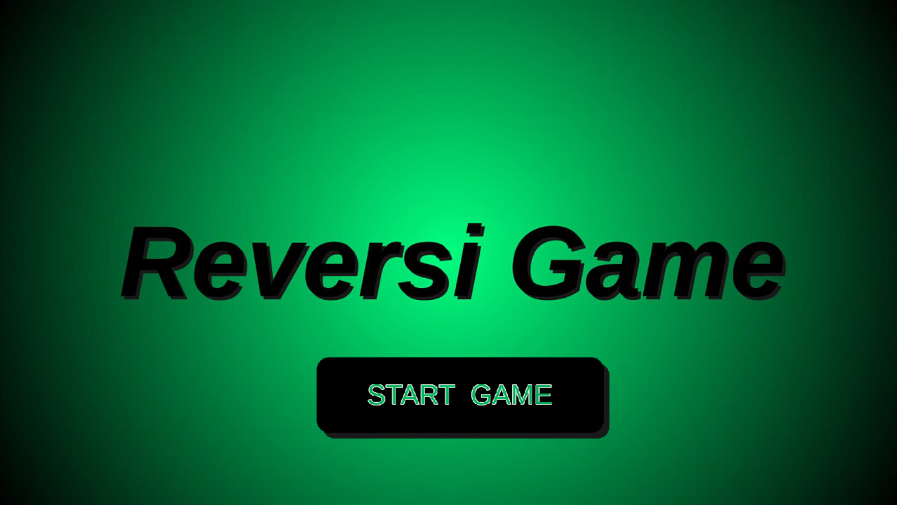
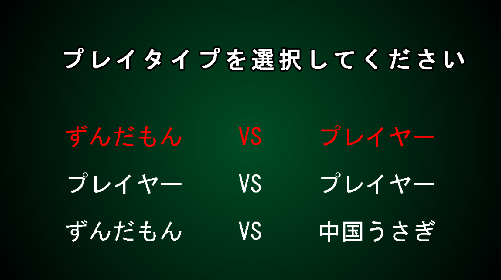
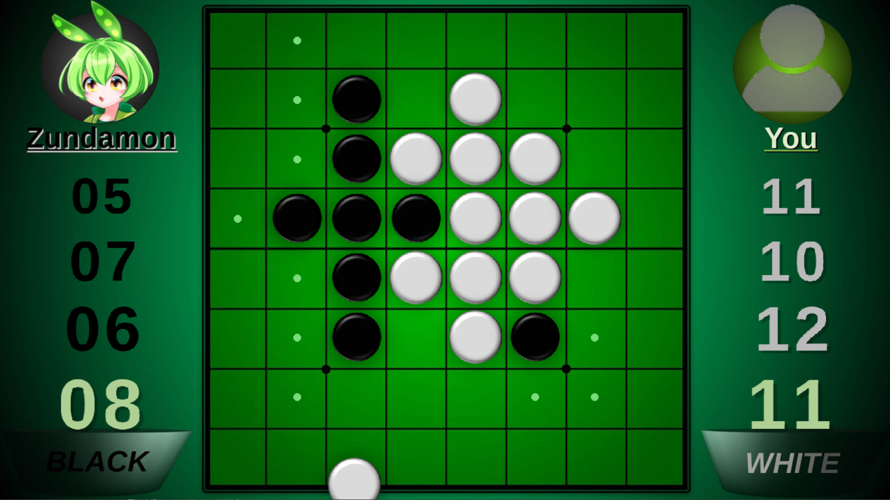

# DxReversi

- [概略](#概略)
- [使い方](#使い方)
- [動作環境](#動作環境)
- [ビルド](#ビルド)
- [インストール](#インストール)
- [注意](#注意)
- [著作権](#著作権)

# 概略

DxLib を使用して作成したリバーシゲームです。ゲーム内ではずんだもんと一緒にリバーシで遊べます。その他にも自動でゲームをプレイさせることもできますし、だれか好きな相手と対戦することだってできます。

# 使い方

プログラムを起動すると、スタート画面が現れます。`START GAME` を押してください。

↓

プレイタイプを選択する画面が現れます。どれか好きなタイプを選んでください。

- **ずんだもん VS プレイヤー** : ずんだもんと一緒にリバーシで遊べます。

- **プレイヤー VS プレイヤー** : 他の誰かと対戦したいときに選択します。

- **ずんだもん VS 中国うさぎ** : ずんだもんと中国うさぎが対戦しているのが見れます。

↓

プレイタイプの選択が終われば、ゲームで遊ぶことができます。画像はずんだもんとのプレイの様子です。

## 使用キー

- `UP`, `DOWN` : プレイタイプを選択
- `ENTER` : プレイタイプを決定
- `ESC` : ゲームを終了
- `CTRL` + `R` : 中断してリプレイ

# 動作環境

Windows 10, 11

# ビルド

ソースコードのビルドには Visual Studio 2022 が必要となります。ソリューションファイルを開き、ソリューションのビルドを選択してもらうとビルドができます。MSVC 以外のコンパイラを使ってビルドをするには、ソースコードの多少の改変や MAKEFILE の作成を自身でしてもらう必要があります。

# インストール

ダウンロードした Zip ファイルを適当なディレクトリに展開してください。そしたら `DxReversi.exe` という実行ファイルをクリックしてゲームを開始できます。

# 注意

- 万が一フルスクリーンモードでゲームが終了できなくなったら、`Windows` キーを押してウィンドウを強制的に閉じてください。閉じた後はタスクマネージャーからゲームを強制的に終了する必要があります。

- `DxReversi.exe` のあるディレクトリに含まれる `AppData/` を削除しないでください。実行ファイル単体ではプログラムは正常に動作しません。

- プログラムを実行するときは、`DxReversi.exe` のあるディレクトリが作業ディレクトリとなるようにしてください。そうでないとアセットへの参照がうまくいきません。

# 著作権

- DxReversi の著作権は [Kohakunchosu](https://github.com/Kohakunchosu) が有します。

- このプロジェクトに含まれるプロジェクト固有のソースコードやその他の素材は、MIT ライセンスの許す範囲内において利用することが可能です。著作権及び許諾の詳細については、[LISENCE](LISENCE) をご覧ください。

- ルートディレクトリを基準として `Source/` `Header/` に含まれるファイルはプロジェクト固有のものです。`AppData/` にはプロジェクト固有のものとサードパーティ製のものが混在しております。どれがプロジェクト固有のものかを見分けるには、各ディレクトリに含まれる `NOTICE.txt` をご覧ください。

- このプロジェクトには、サードパーティ製の素材が含まれています。このプロジェクトにどのような素材が使用されているかは、 [NOTICE.md](NOTICE.md) にて確認できます。フォークや再配布を行う際は、 [NOTICE.md](NOTICE.md) にある著作権及び許諾の表記を含めてください。

- [東北ずん子・ずんだもんプロジェクト](https://zunko.jp) によるイラストを含む画像ファイルは、二次的著作物となるため、プロジェクト固有のものであっても MIT ライセンスの許す範囲内での利用の対象外となります。利用につきましては、[キャラクター利用の手引き](https://zunko.jp/guideline.html) の中で許されている範囲内において、画像の商用、非商用での利用を許可します。

Copyright (c) 2024 Kohakunchosu

---

リポジトリをご覧いただきありがとうございます。質問や感想、要望、不具合などがありましたら、下記のメールアドレスや Issue にてご連絡ください。

kohakunchosu@outlook.com
